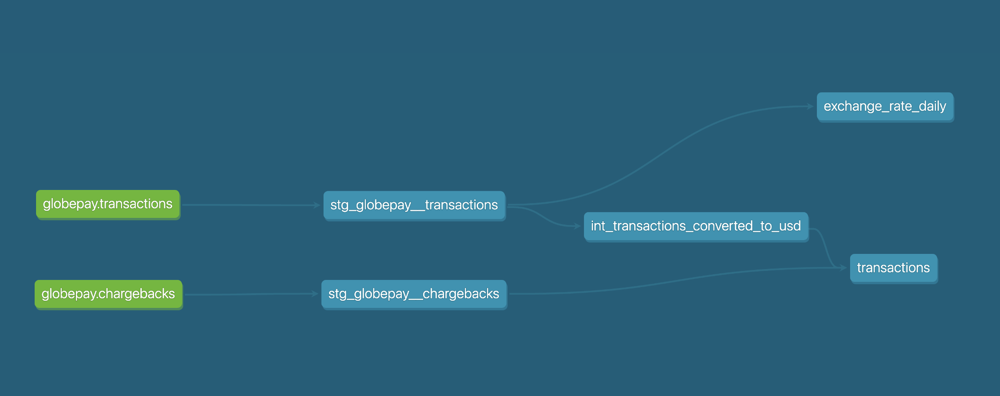
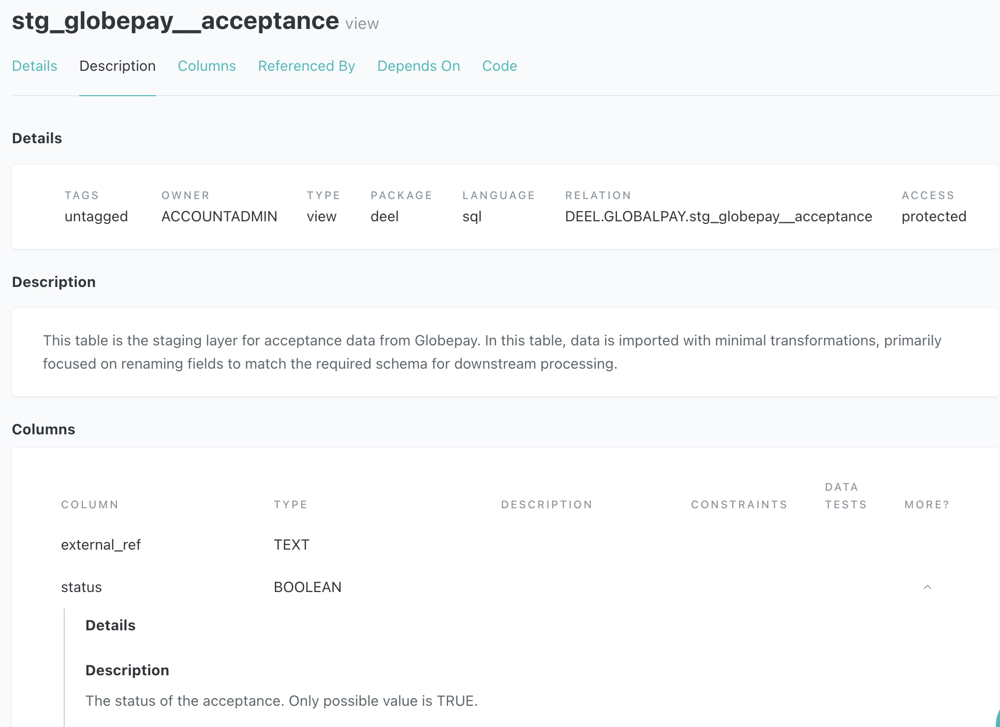

# Analytics Engineer Task
Hello! :smiley:	
Please find all the implementation details below.

## Project Overview
This project implements a data transformation pipeline using dbt (Data Build Tool) that processes Globepay transactionss and creates analytical models for reporting.


## Table of Contents

### Part 1 
0. [Prerequisites to run the project](README.md#0-prerequisites-to-run-the-project)
1. [How to Run the Project](README.md#1-how-to-run-the-project)
2. [Preliminary Data Exploration](README.md#2-preliminary-data-exploration)
3. [Model Architecture and Lineage](README.md#3-model-architecture-and-lineage)
4. [Key Features of the Project](README.md#4-key-features-of-the-project)
5. [Documentation](README.md#5-documentation)
6. [Testing](README.md#6-testing)
7. [Macros](README.md#7-macros)
8. [Future Enhancements](README.md#8-future-enhancements)
9. [Assumptions](README.md#9-assumptions)
10. [Extra note](README.md#10-extra-note)

### Part 2
1. [Mart in use](part2.md#part-2)

## 0. Prerequisites to run the project
#### Python installation
You need to have Python installed, ideally version 3.12, as it is the latest version compatible with dbt-snowflake.
Please verify it using the following commands:
```
python3 --version # For Mac/Linux
python --version # For Windows
```
If it is not installed:
- *Mac*: You can install Python via [Homebrew](https://brew.sh/) or use the built-in version of [Python 3](https://www.python.org/).
```
brew install python
```
- *Linux*: Python is likely already installed on most Linux distributions.
To install or update it:
```
sudo apt update
sudo apt install python3 python3-pip
```

## 1. How to Run the Project
1. Navigate to the project path.
2. Run the following command to create a virtual environment:
```
python3 -m venv dbt-env # For Mac/Linux
python -m venv dbt-env # For Windows
```
3. Activate the virtual environment.
```
source dbt-env/bin/activate # For Mac/Linux
.\dbt-env\Scripts\activate # For Windows
```
4. Install the required packages.
```
pip install -r requirements.txt
```

### Snowflake connection
6. I created a Snowflake test account and uploaded the files to simulate a database connection. 
The credentials to connect to Snowflake can be found in the following [1Password link](https://share.1password.com/s#tNX2ZLC7aR_IZJG8xtEROprCv-Meen-3JcWdLYikYTU). To establish the connection, add the provided password to the .dbt/profiles.yml file.
<br>**Note**: On a production environment, I would use environment variables to store credentials or leverage Snowflake’s OAuth. I would not use 1Password, as it lacks automation and does not scale. Additionally, with more time I would have created a role and user to grant warehouse privileges based on [Snowflake's permissions documentation](https://docs.getdbt.com/reference/database-permissions/snowflake-permissions)

5. Finally, use dbt debug command to test the connection. If successful, you are now connected and ready to run the project. :smile:

## 2. Preliminary Data Exploration
#### Data Sources - The primary sources include:

- **Transactions Table (Acceptance Report CSV):** Contains transactional data including transaction id's, amount, currency, and status of each transaction.
- **Chargebacks Table:** Includes data on disputed transactions, marking those that have been flagged for chargeback.

#### Key Fields - Some of the key fields in the datasets include:
- `external_ref`: primary key of transactions and chargebacks table (not null and unique).
- `date_time`: Timestamp of the transaction.
- `currency`: Currency used for the transaction.
- `state`: Whether the transaction was ACCEPTED or DECLINED.
- `chargeback`: Indicator showing if the transaction was flagged for chargeback (TRUE or FALSE).

#### Data Quality:
- **Missing Data:** No missing or null values were found.
- **Relationships:** There is a one-to-one relationship between the transactions and chargebacks tables, with external_ref as the linking and primary key.
- **Data Consistency:** The `state` field contains consistent values (ACCEPTED and DECLINED), and the `chargeback` field is consistently populated with TRUE or FALSE.
- **Data Types:** 
- BOOLEAN is used for binary fields such as `status`, `cvv_provided`, and `chargeback`.
- TIMESTAMP_NTZ is used for `date_time`
- NUMBER is used for `amoumt`
All the other fields are VARCHAR.

#### Data distribution:
- **Transaction Counts:** A total of 5430 transactions are present in both tables, with 69% of transactions accepted and 4% flagged for chargeback.
- **Country Breakdown:** The dataset includes 905 transactions per country from the US, MX, UK, FR, CA, and AE.

#### Initial Findings:
- Based on initial exploration, there appear to be no data quality issues that would affect the subsequent analysis or model development.

## 3. Model Architecture and Lineage
The architecture of the project is based on the following
[dbt recommendation](https://docs.getdbt.com/best-practices/how-we-structure/1-guide-overview)
- `staging`: Contains a view from the raw data. Making only renaming if necessary or conversion to the correct datatype.
- `intermediate`: Contains working tables that remove complexity to the marts. They are not supposed to be requested. Materialized as ephemeral.
- `marts`: Contain the data to support a business unit. Materialized as tables.
- `utilities`: This table supports other joins and aggregations. In this project, it includes the exchange_rate_daily table, which stores the latest exchange rate for each country on a given day, derived from the rates array in the transactions table. 

| tables       | prefix |
| ------------ | ------ |
| staging      | stg    |
| intermediate | int    |

#### Final lineage


#### Transactions mart
| Column Name                   | Data Type  | Description                                         |
|--------------------------------|------------|-----------------------------------------------------|
| `transaction_id`                    | VARCHAR    | Unique identifier for each transaction.                  |
| `transaction_at`                  | DATE       | Date and time of the transaction.                                 |
| `transaction_country`         | VARCHAR    | Country where the transaction occurred.              |
| `transaction_currency`        | VARCHAR    | Currency in which the transaction was made.                |
| `original_currency_transaction_amount`           | DECIMAL    | Transaction amount in the original currency.      |
| `usd_transaction_amount`              | DECIMAL    | Transaction amount converted to USD.                                  |
| `is_transaction_accepted`                  | BOOLEAN    | Indicates if the transaction was accepted (1 for accepted).                            |
| `is_chargeback`           | BOOLEAN    | Indicates if the transaction is marked as a chargeback (1 for chargeback). |


## 4. Key Features of the Project
### Packages Used
1. [Constraints Package](https://hub.getdbt.com/Snowflake-Labs/dbt_constraints/latest/) - to validate the uniqueness of primary keys, ensure foreign key constraints or unique keys. This has been applied to all the models.
2. [Meta Testing Package](https://hub.getdbt.com/tnightengale/dbt_meta_testing/latest/) - to validate documentation coverage, enforcing all models and fields are properly documented. To test run `dbt run-operation required_docs`

### SQLFluff for Linting
Following [dbt's recommendation](https://docs.getdbt.com/best-practices/how-we-style/2-how-we-style-our-sql), the project uses SQLFluff for linting. This should ensure readability and maintainability. All the rules are defined [here](https://docs.sqlfluff.com/en/stable/reference/rules.html). 
- To run this use the following command in the terminal `sqlfluff lint models`
- It is also possible to fix the errors by running `sqlfluff fix models`

### Style in dbt models
- The filed name `id` has been prefixed by what it is identifying (eg. id as ref_id)
- The `as` operator is used when aliasing a column or table
- When joining tables and referencing columns from both, prefer to reference the full table name 
- It is using table aliases in join conditions and not using initialisms (eg. “chargebacks” instead of "c”)
- Timestamps end with `_at`
- Dates end with `_date`
- Booleans are prefixed with `is_` or `has_`.

## 5. Documentation
### Jinja for Documentation Blocks
The project leverages Jinja with the creation of [documentation blocks](https://docs.getdbt.com/docs/build/documentation#using-docs-blocks) in the `.md` file extension of the models. These blocks provide a centralized way to define and manage documentation for models, columns, and their context. The documentation is referenced in the `.yml` files, ensuring consistency and maintainability.

#### Documentation Definition Workflow
- The documentation for a column is defined in the first model where the column appears (usually in the staging layer).
- The column descriptions are inherited throughout the transformation process, avoiding duplication and maintaining clarity.

#### About docs commands
We can visualize the documentation with two different commands: `dbt docs serve` & `dbt docs generate`
1. `dbt docs serve`: This command starts a webserver on port 8080 to serve your documentation locally and opens the documentation site in your default browser.



2. `dbt docs generate`: Produce the catalog.json file, which contains metadata about the tables and views produced by the models. This can be used on different data catalog tools.

## 6. Testing
- **Unit test**: Validating SQL Modeling Logic on static inputs.
In _int_finance__models a unit test has been added to validate the logic of the amount transformation to USD. To test it please run  `dbt test -s test_usd_transaction_amount`

- **Primary Key and Uniqueness Tests**: 
Using the dbt_constraints package, this project ensures primary key, uniqueness, and other custom tests. For example, in the exchange_rate_daily model it uses unique_key test to ensure there is one unique date_day and currency combination.

## 7. Macros
The project includes the `convert_to_usd` macro, which converts an amount to USD. By centralizing this logic, we ensure consistency and avoid code duplication across models.

## 8. Future Enhancements
1. **Alerting**
- Freshness is not currently defined in the sources.yml because the data is manually uploaded as a CSV file to Snowflake and is not subject to regular updates. If integrated with an automated pipeline in the future, freshness checks can be configured.
- Freshness checks can also be connected to tools like Slack, enabling automated alerts if a table becomes outdated. This proactive approach helps the team quickly identify and resolve data pipeline issues, minimizing downstream impact.

2. **Materialization**
- For now there is only one mart in the project. When more marts start to be created it would be a good time to use `incremental` models to reduce build time and prevent `dbt run` to become too slow.

3. **CI/CD**
- Once connected to a production environment a continuous integration (CI) workflow needs to be implemented. This will run a series of checks before allowing the merge to production. From the existing implementation the checks that could be added to the CI jobs are:
- `sqlfluff lint models`
- `dbt build --select state:modified+`
- `dbt test`
- `dbt run-operation required_docs`
- `dbt source freshness` (after freshness has been added)

4. **Testing**
- There is a single unit test in the entire project, but ideally there should be one for every transformation. 

## 9. Assumptions
- Given this data is related to transactions and chargeback, I assumed that the primary stakeholders would be the Finance team. As a result, I placed this mart within the Finance folder. However, it could also be relevant to other teams, depending on organizational needs.

## 10. Extra note
Hi there :wave:

This was a very interesting project!
I’m looking forward to your feedback and I'd be happy to discuss the task further.

Best,  
Paty
