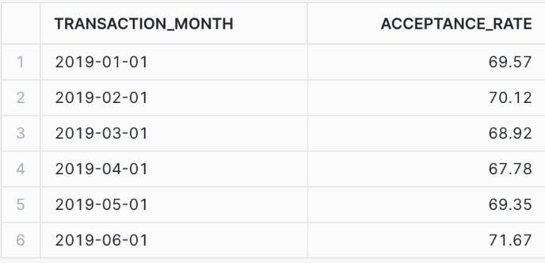
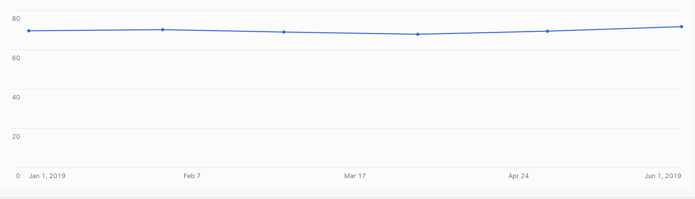
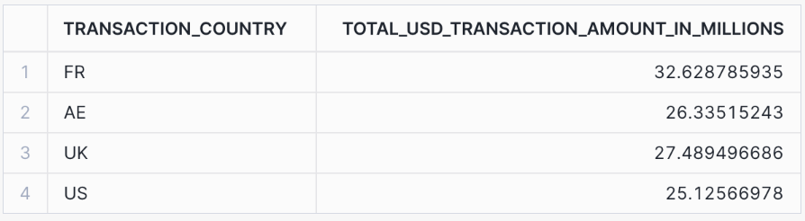
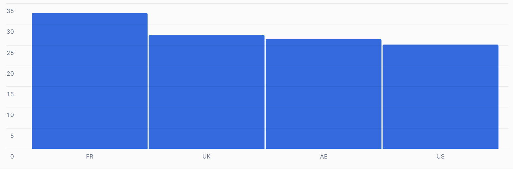

# Mart in use

## Part 2
### 1. What is the acceptance rate over time? 
- #### Code using transactions mart:
```
select
    date_trunc('month', transaction_at)::date AS transaction_month,
    ((sum(is_transaction_accepted)/count(*))*100)::decimal(10,2) as acceptance_rate
from DEEL.GLOBEPAY.TRANSACTIONS
group by 1
order by transaction_month asc
```

- #### Actual answers
- 

- #### Brief description
The query produces the monthly acceptance rates for transactions over a six-month period in 2019. The acceptance rate is expressed as a percentage, showing the proportion of accepted transactions each month.

**Trend Overview:**
The acceptance rate fluctuates slightly, ranging between 67.78% and 71.67%.
The lowest acceptance rate occurred in April 2019 (67.78%), while the highest was in June 2019 (71.67%).
There is a general improvement in the acceptance rate toward the end of the period.

- #### Supporting image
- 

### 2. List the countries where the amount of declined transactions went over $25M
- #### Code using transactions mart:
```
select
    transaction_country,
    sum(usd_transaction_amount) / 1000000 as total_usd_transaction_amount_in_millions
from DEEL.GLOBEPAY.TRANSACTIONS
where is_transaction_accepted = 0
group by 1
having total_usd_transaction_amount_in_millions > 25
```

- #### Actual answers
- 

- #### Brief description
The query highlights countries with declined transactions exceeding $25M in USD, including France, UAE, UK, and the US. Comparing these figures to the total transaction count per country could reveal regions with disproportionately high decline rates.

- #### Supporting image
- 

### 3. Which transactions are missing chargeback data?
- #### Code using transactions mart:
```
select transaction_id
from DEEL.GLOBEPAY.TRANSACTIONS
where is_chargeback is null
```
- #### Actual answers
No transactions are missing chargeback data.

- #### Brief description
Initial exploration confirmed that all transaction IDs in the Transactions table are present in the Chargebacks table. Both source tables contain the same number of rows, indicating no discrepancies.

